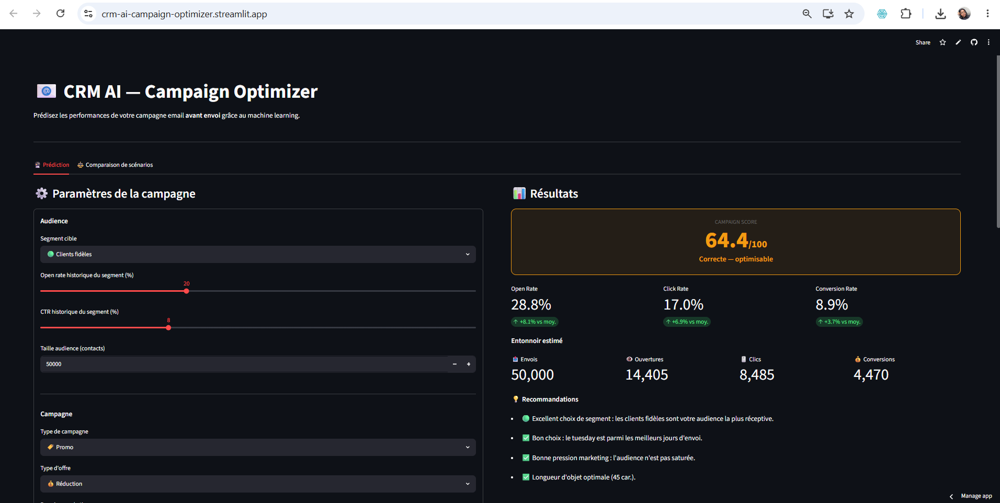
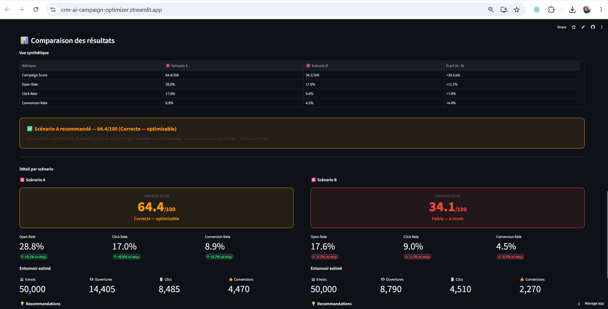

# 📧 CRM AI — Campaign Optimizer

> Application CRM intelligente permettant de **prédire les performances de campagnes email avant envoi** grâce au machine learning, et d'optimiser les décisions marketing grâce à des insights business automatiques.

🔗 **App en ligne** : https://crm-ai-campaign-optimizer.streamlit.app

---

## 🖥️ Aperçu

### Prédiction de campagne


### Comparaison de scénarios


---

## 🎯 Contexte & Objectif

Les équipes CRM envoient des campagnes email sans savoir à l'avance si elles vont performer. Le taux d'ouverture, le taux de clic et le taux de conversion ne sont connus qu'**après** l'envoi.

**CRM AI Campaign Optimizer** résout ce problème en permettant à un CRM manager de :
- Simuler les performances d'une campagne **avant envoi**
- Comparer deux scénarios de campagne côte à côte
- Recevoir des recommandations business actionnables
- Obtenir un **Campaign Score /100** synthétique et immédiatement lisible

---

## 🏗️ Architecture

```
Utilisateur → Application Streamlit → Formulaire campagne
→ 3 modèles RandomForest → Prédictions KPI
→ Campaign Score /100 → Insights business
```

---

## 🤖 Modèles Machine Learning

| Modèle | Target | MAE | R² |
|--------|--------|-----|----|
| RandomForestRegressor | open_rate | 0.0227 | 0.83 |
| RandomForestRegressor | click_rate | 0.0128 | 0.86 |
| RandomForestRegressor | conversion_rate | 0.0080 | 0.88 |

**Dataset** : 5 000 campagnes email synthétiques avec logiques métier CRM intégrées  
**Features** : 17 variables (segment, campagne, jour/heure, objet, pression marketing...)

### Campaign Score

| Score | Interprétation |
|-------|----------------|
| 80-100 | Campagne excellente |
| 65-80 | Bonne campagne |
| 40-65 | Correcte — optimisable |
| 0-40 | Faible — à revoir |

---

## 📊 Insights Business Automatiques

- 🟢 Les clients fidèles ont un open rate de 29.2% (+8.4% vs moyenne)
- 📅 Mardi est le meilleur jour d'envoi (22.4%), dimanche le pire (18.8%)
- 📝 Les objets de 30-50 caractères surperforment
- 📨 Faible pression marketing (≤2) surperforme forte pression (≥5) de 3.5%
- ✉️ La personnalisation améliore l'open rate de +1.8%
- 🛒 Cart Abandonment est le type de campagne le plus performant (22.7%)

---

## 🛠️ Stack Technique

| Composant | Technologie |
|-----------|-------------|
| Language | Python 3.11 |
| ML | scikit-learn — RandomForestRegressor |
| Data | pandas, numpy |
| App | Streamlit |
| Déploiement | Streamlit Community Cloud |

---

## 🚀 Lancer en local

```bash
git clone https://github.com/tokamjohana-stack/crm-ai-campaign-optimizer.git
cd crm-ai-campaign-optimizer
pip install -r requirements.txt
python train_models.py
streamlit run app.py
```

---

## 📁 Structure

```
crm-ai-campaign-optimizer/
├── app.py                                 # Application Streamlit
├── train_models.py                        # Entraînement des modèles
├── requirements.txt                       # Dépendances
├── runtime.txt                            # Python 3.11.15
├── crm_email_campaigns_synthetic_5000.csv
├── screenshots/
│   ├── prediction.png
│   └── comparaison.png
└── models/
    ├── model_open_rate.joblib
    ├── model_click_rate.joblib
    ├── model_conversion_rate.joblib
    ├── benchmarks.joblib
    └── insights.joblib
```

---

## 💼 Contexte Portfolio

Postes visés : **CRM AI Specialist · AI CRM Consultant · Data-Driven CRM Analyst**

Ce projet démontre :
- Compréhension des KPI CRM (open rate, click rate, conversion)
- Modélisation ML appliquée (RandomForest, pipeline sklearn)
- Logique produit orientée utilisateur métier (CRM manager)
- Déploiement cloud opérationnel

---

## 👤 Auteur

**Johana Tokam**  
Master Marketing Digital & Data Analytics — EMLV + IIM  

[](https://linkedin.com/in/TON_PROFIL)
[](https://github.com/tokamjohana-stack)
